# Laporan Proyek Machine Learning - Joko Prabowo

## Domain Proyek
Game berasal dari kata inggris yang berarti permainan. Permainan adalah sesuatu yang digunakan untuk bermain yang dimainkan dengan aturan-aturan tertentu. Game adalah permainan yang menggunakan media elektronik, merupakan sebuah hiburan berbentuk mulimedia yang dibuat semenarik mungkin agar pemain mendapatkan sesuatu sehingga mendapatkan kepuasan batin (Purnama, 2021). Permainan dapat dimainkan menggunakan media elektronik apapun, mulai dari komputer, laptop, tablet, bahkan melalui telpon genggam. Hal ini membuat siapapun dan dari kalangan manapun bisa memainkan permainan tersebut. Google Play adalah layanan distribusi digital yang dioperasikan dan dikembangkan oleh Google. Layanan ini berfungsi sebagai toko aplikasi resmi untuk sistem operasi Android, memungkinkan pengguna untuk menelusuri dan mengunduh aplikasi yang dikembangkan menggunakan kit pengembangan perangkat lunak Android (SDK) dan diterbitkan melalui Google (Wahyudi, 2022). Google Play merupakan penyedia layanan terutama permainan yang paling laris pada saat ini.

Sistem rekomendasi adalah metode yang digunakan untuk memberikan rekomendasi dengan memprediksi nilai suatu item bagi seorang pengguna, kemudian menyajikan item dengan nilai prediksi tertinggi. Prediksi dalam sistem rekomendasi dapat diterapkan pada berbagai bidang, seperti buku, musik, film, tempat wisata, dan banyak lagi (Sari et al., 2020). Oleh karenanya dalam proyek ini penulis ingin membuat sistem rekomendasi untuk merekomendasikan permainan yang ada pada Google Playstore menggunakan dua metode yaitu metode Content-based filtering, dan metode Collaborative filtering.

## Business Understanding

### Problem Statements
Berdasarkan latar belakang yang telah dipaparkan. Berikut adalah daftar permasalahan yang perlu diselesaikan dalam proyek ini:
<ul>
  <li>Permainan apa yang paling diminati oleh pengguna.</li>
  <li>Bagaimana cara membuat sistem rekomendasi yang baik.</li>
  <li>Sistem rekomendasi yang seperti apa yang baik untuk digunakan.</li>
</ul>

### Goals
<ul>
  <li>Mengetahui permainan yang paling banyak diminati pengguna.</li>
  <li>Membuat sistem rekomendasi menggunakan metode Content-based filtering serta Collaborative filtering.</li>
  <li>Mengevaluasi hasil dari sistem rekomendasi yang telah dibuat berdasarkan metriknya masing-masing.</li>
</ul>

### Solution Statements
<ul>
  <li>Melakukan Exploratory Data Analysis (EDA) terhadap data yang ada.</li>
  <li>Mengimplementasikan Content-based filtering serta Collaborative filtering pada sistem rekomendasi.</li>
  <li>Melakukan evaluasi terhadap performa dari model yang telah dibuat.</li>
</ul>

## Data Undestanding
Data yang digunakan dalam proyek ini merupakan data yang dipublikasikan oleh Dhruvil Dave, yang merupakan data mengenai permainan berbasis android yang dikumpulkan melalui Google Play dan telah diklasifikasikan kedalam setiap kategorinya dimana setiap kategori setidaknya memiliki 100 permainan. Keterangan lebih lanjut mengenai dataset ini adalah sebagai berikut:

<div align="center">
  
  Indeks|Keterangan
  ---|---
  Title|Top Games on Google Play Store
  Source|[Kaggle](https://www.kaggle.com/datasets/dhruvildave/top-play-store-games)
  Uploader|Dhruvil Dave
  Owner|Google Play
  License|Database: Open Database, Contents: © Original Authors
  Usability|10.00
  Tags|Education, Games, Video Games
  
</div>

Dalam dataset ini memiliki beberapa fitur yang tersimpan kedalam beberapa variabel sebagai berikut:

<div align="center">

  Variabel|Keterangan
  ---|---
  rank|peringkat dalam kategori tertentu
  title|judul game
  total rating|jumlah total penilaian
  installs|perkiraan tonggak instalasi
  average rating|penilaian rata-rata dari bintang 5
  growth (30 days)|pertumbuhan persen dalam 30 hari
  growth (60 days)|pertumbuhan persen dalam 60 hari
  price|harga dalam dolar
  category|kategori permainan
  5 star ratings|jumlah penilaian bintang 5
  4 star ratings|jumlah penilaian bintang 4
  3 star ratings|jumlah penilaian bintang 3
  2 star ratings|jumlah penilaian bintang 2
  1 star ratings|jumlah penilaian bintang 1
  paid|permainan berbayar atau tidak
  
</div>

Keterangan untuk setiap kolom dari dataset ini adalah sebagai berikut:

<div align="center">

  Index|Valid|Mismatched|Missing|
  ---|---|---|---
  rank|1730|0|0|0
  title|1730|0|0|0
  total rating|1730|0|0|0
  installs|1730|0|0|0
  average rating|1730|0|0|0
  growth (30 days)|1730|0|0|0
  growth (60 days)|1730|0|0|0
  price|1730|0|0|0
  category|1730|0|0|0
  5 star ratings|1730|0|0|0
  4 star ratings|1730|0|0|0
  3 star ratings|1730|0|0|0
  2 star ratings|1730|0|0|0
  1 star ratings|1730|0|0|0
  paid|1730|0|0|0
  
</div>

Berdasarkan tabel diatas dapat disimpulkan bahwa pada dataset ini terdapat `15 kolom` dengan `1730 baris` dimana setiap barisnya merupakan data yang valid tanpa ada satupun data yang hilang.

## Exploratory Data Analysis

### Deskripsi Variabel
Berdasarkan detail deskripsi dari data ditemukan bahwa:

<div align="center">

#|Column|Non-Null Count|Dtype  
---|---|---|---  
 0|rank|1730 non-null|int64  
 1|title|1730 non-null|object 
 2|total ratings|1730 non-null|int64  
 3|installs|1730 non-null|object 
 4|average rating|1730 non-null|int64  
 5|growth (30 days)|1730 non-null|float64
 6|growth (60 days)|1730 non-null|float64
 7|price|1730 non-null|float64
 8|category|1730 non-null|object 
 9|5 star ratings|1730 non-null|int64  
 10|4 star ratings|1730 non-null|int64  
 11|3 star ratings|1730 non-null|int64  
 12|2 star ratings|1730 non-null|int64  
 13|1 star ratings|1730 non-null|int64  
 14|paid|1730 non-null|bool
  
</div>

Berdasarkan data diatas dapat terlihat bahwa:
*   Terdapat 4 kolom kategorik dengan tipe data object dan bool, yaitu `title`, `installs`, `category`, dan `paid`
*   Terdapat 11 kolom numerik dengan tipe data int64, dan float64, yaitu `rank`, `total ratings`, `average rating`, `growth (30 days)`, `growth (60 days)`, `price`, `5 star ratings`, `4 star ratings`, `3 star ratings`, `2 star ratings`, dan `1 star ratings`


<p>Kemudian melalui data deskripsi juga ditemukan informasi statistik dari setiap kolom diantaranya:</p>

 |rank|total ratings|average rating|growth (30 days)|growth (60 days)|price|5 star ratings|4 star ratings|3 star ratings|2 star ratings|1 star ratings
---|---|---|---|---|---|---|---|---|---|---
count|1730.000000|1.730000e+03|1730.000000|1730.000000|1730.000000|1730.000000|1.730000e+03|1.730000e+03|1.730000e+03|1.730000e+03|1.730000e+03
mean|50.386705|1.064332e+06|3.908092|321.735896|122.554971|0.010942|7.622315e+05|1.164366e+05|5.706307e+04|2.710336e+04|1.014950e+05
std|28.936742|3.429250e+06|0.290973|6018.914507|2253.891703|0.214987|2.538658e+06|3.021631e+05|1.495314e+05|8.154542e+04|4.083745e+05
min|1.000000|3.299300e+04|2.000000|0.000000|0.000000|0.000000|1.397500e+04|2.451000e+03|7.180000e+02|2.660000e+02|5.450000e+02
25%|25.000000|1.759992e+05|4.000000|0.100000|0.200000|0.000000|1.277300e+05|2.064300e+04|9.652500e+03|4.262250e+03|1.281200e+04
50%|50.000000|4.286065e+05|4.000000|0.500000|1.000000|0.000000|2.964340e+05|5.098050e+04|2.507800e+04|1.067550e+04|3.368600e+04
75%|75.000000|8.837970e+05|4.000000|1.700000|3.300000|0.000000|6.198358e+05|1.018140e+05|5.229500e+04|2.322875e+04|8.015725e+04
max|100.000000|8.627313e+07|4.000000|227105.700000|69441.400000|7.490000|6.354677e+07|5.404966e+06|3.158756e+06|2.122183e+06|1.249592e+07

Dimana:
<ul>
  <li>count merupakan jumlah sampel,</li>
  <li>mean merupakan nilai rata-rata,</li>
  <li>std merupakan standar deviasi,</li>
  <li>min merupakan nilai minimum,</li>
  <li>25% merupakan kuartil pertama,</li>
  <li>50% merupakan kuartil kedua,</li>
  <li>75% merupakan kuartil ketiga, dan</li>
  <li>max merupakan nilai maximum.</li>
</ul>

### Univariate analysis
<div align="center">
  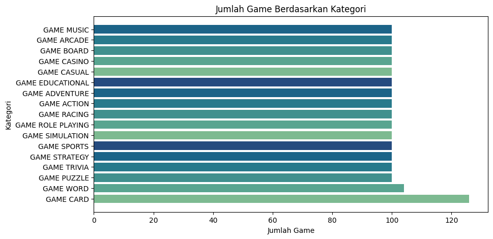
</div>
<p>Data visual diatas merupakan diagram batang yang memvisualisasikan total permainan yang ada pada setiap kategori, dan dari sekian banyaknya kategori permainan "Game Card" atau permainan kartu merupakan kategori permainan yang memiliki total jumlah permainan terbanyak.</p>

<div align="center">
  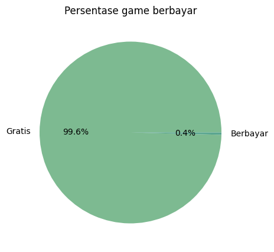
</div>
<p>Data visual diatas merupakan diagram lingkaran yang memvisualisasikan jenis permainan yang dibedakan menjadi permainan gratis, dan berbayar. Dari data visual tersebut dapat terlihat bahwa mayoritas permainan yang terdapat dalam dataset ini merupakan permainan gratis dengan persentase mencapai 99.6%.</p>

<div align="center">
  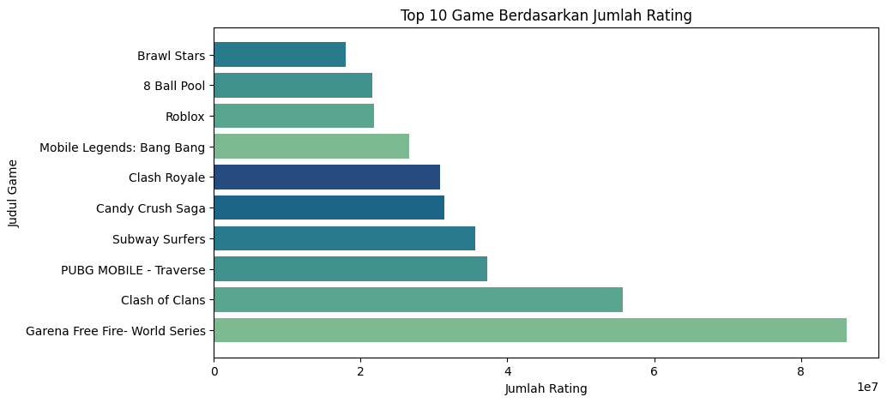
</div>
<p>Data visual diatas merupakan diagram batang yang memvisualisasikan 10 permainan teratas dengan total penilaian paling tinggi. Dari data  tersebut permainan Garena Free Fire - World Series menempati urutan pertama dengan lebih dari 8e7 penilaian atau lebih dari 80.000.000 total penilaian.</p>

<div align="center">
  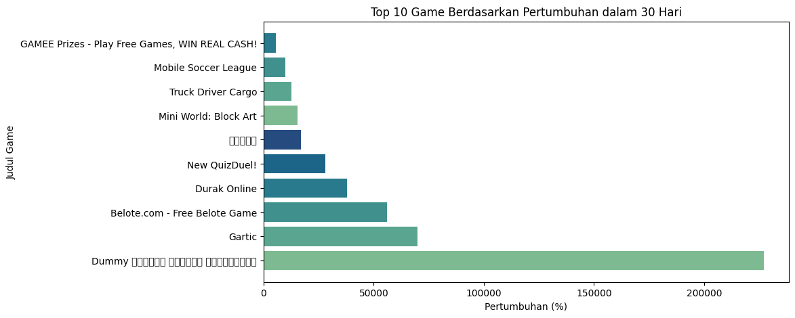
</div>
<p>Data visual diatas menampilkan 10 permainan dengan tingkat pertumbuhan pengguna paling tinggi dalam 30 hari.</p>

<div align="center">
  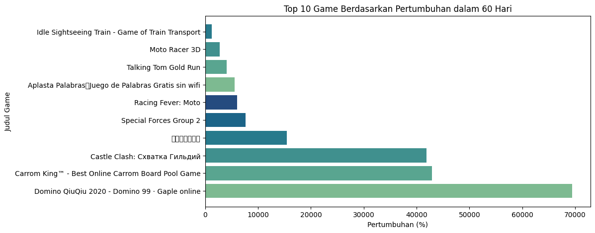
</div>
<p>Data visual diatas menampilkan 10 permainan dengan tingkat pertumbuhan pengguna paling tinggi dalam 60 hari.</p>

### Multivariate analysis
<div align="center">
  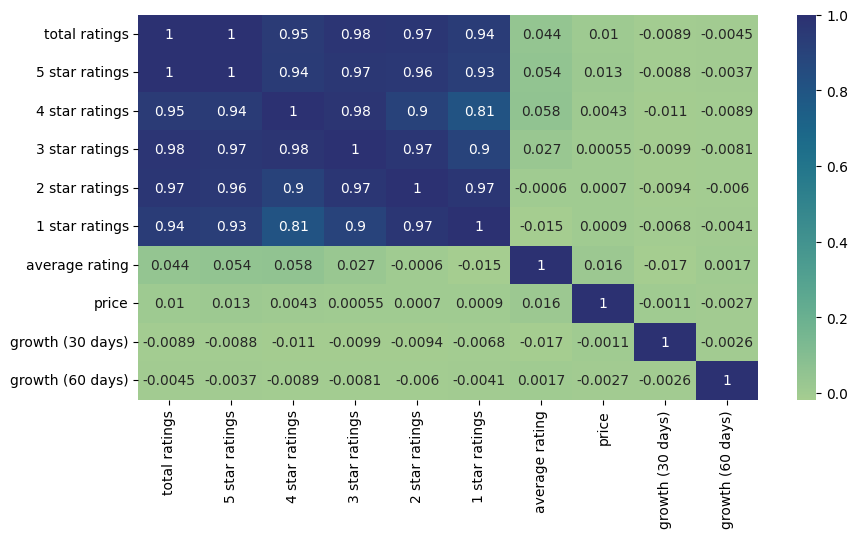
</div>
<p>Data visual diatas merupakan heatmap atas setiap data numerik dalam dataset ini beserta nilai korelasi antar setiap fitur.</p>

<div align="center">
  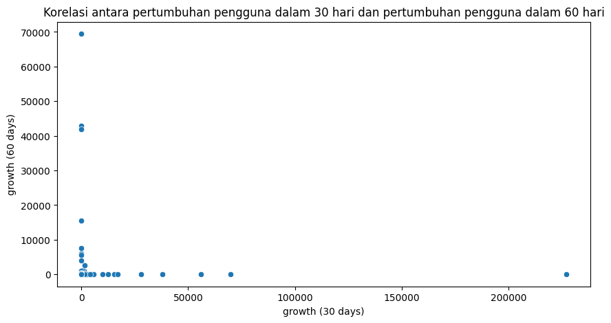
</div>
<p>Data visual diatas merupakan diagram tebar yang memvisualisasikan korelasi antara pertumbuhan pengguna dalam 30 hari dan pertumbuhan pengguna dalam 60 hari. Berdasarkan nilai korelasi yang didapatkan melalui heatmap (-0.0026) dan data visual diatas disimpulkan bahwa fitur pertumbuhan pengguna dalam 30 hari dan pertumbuhan pengguna dalam 60 hari memiliki hubungan yang lemah.</p>

<div align="center">
  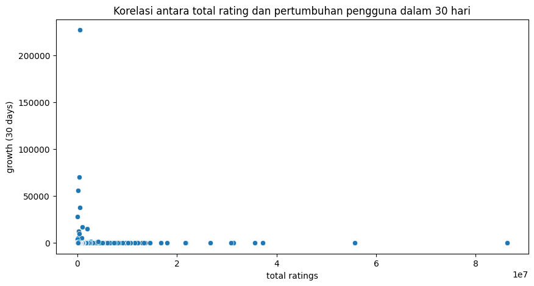
</div>
<p>Data visual diatas merupakan diagram tebar yang memvisualisasikan korelasi antara total penilaian dan pertumbuhan pengguna dalam 30 hari. Berdasarkan nilai korelasi yang didapatkan melalui heatmap (-0.0089) dan data visual diatas disimpulkan bahwa fitur total penilaian dan pertumbuhan pengguna dalam 30 hari memiliki hubungan yang lemah</p>

<div align="center">
  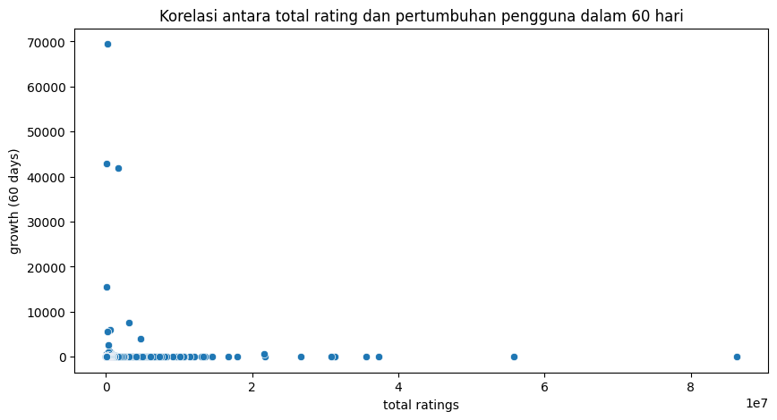
</div>
<p>Data visual diatas merupakan diagram tebar yang memvisualisasikan korelasi antara total penilaian dan pertumbuhan pengguna dalam 60 hari. Berdasarkan nilai korelasi yang didapatkan melalui heatmap (-0.0045) dan data visual diatas disimpulkan bahwa fitur total penilaian dan pertumbuhan pengguna dalam 60 hari memiliki hubungan yang lemah</p>

<div align="center">
  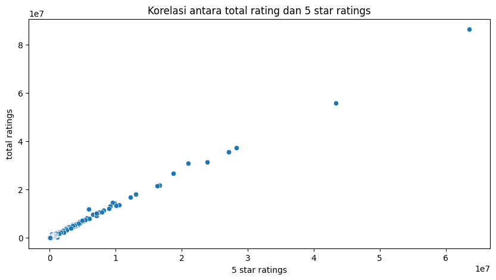
  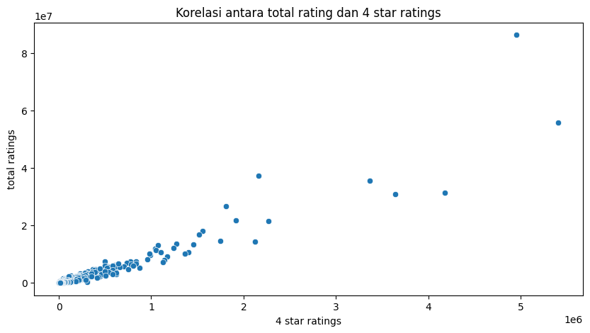
  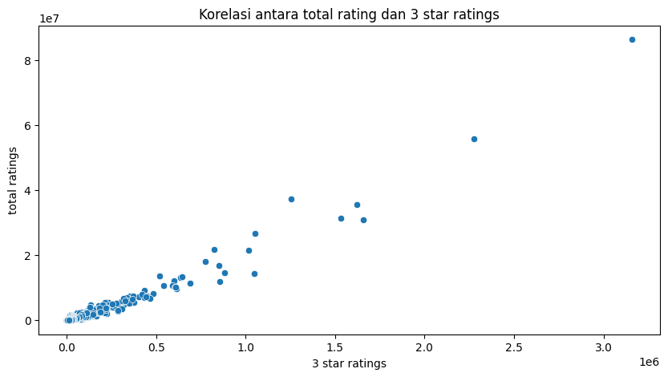
  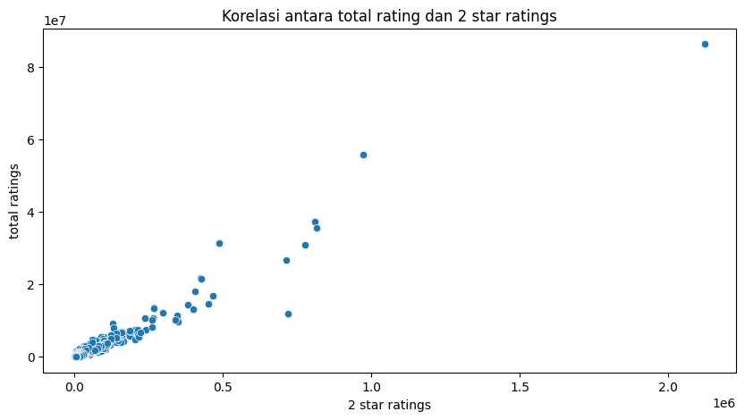
  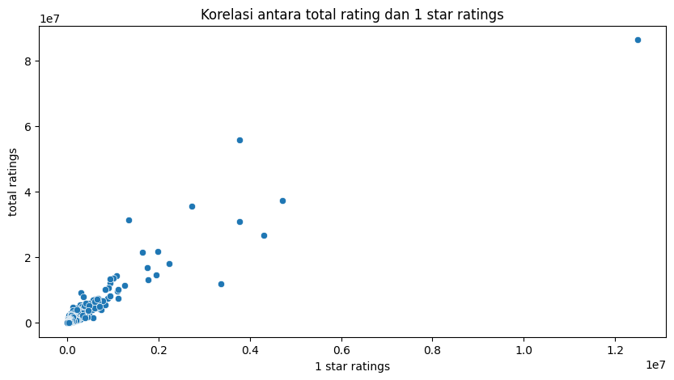
</div>
<p>Data visual diatas merupakan diagram tebar yang memvisualisasikan korelasi antara total penilaian dengan penilaian 5 bintang, penilaian 4 bintang, penilaian 3 bintang, penilaian 2 bintang, dan penilaian 1 bintang. Berdasarkan data visual diatas total penilaian memiliki hubungan yang kuat dengan penilaian 5 bintang, penilaian 4 bintang, penilaian 3 bintang, penilaian 2 bintang, dan penilaian 1 bintang. Hal ini dibuktikan melalui skor korelasi yang diperoleh dari heatmap secara berurutan yaitu 1, 0.95, 0.98, 0.97, dan 0.94.</p>

## Data Preparation

### Menangani missing value
<p>Sebelum data diproses lebih lanjut, data terlebih dahulu akan dibersihkan dari data yang mengandung nilai kosong, dan data terduplikat. Hal ini dilakukan agar data-data tidak lengkap tersebut tidak menggangu dalam pengimplementasian model nanti.</p>

```python
df.isnull().sum()
````

<p>Menggunakan kode diatas, didapatkan bahwa tidak ada data kosong dalam dataset ini.</p>

```python
print(len(df[df.duplicated(subset='title')]))
```

<p>Lalu menggunakan kode diatas, diketahui terdapat 55 baris dengan judul permainan yang sama dalam dataset ini yang kemudian perlu dihapus. Sehingga terdapat total 1675 baris dengan 15 kolom setelah data terduplikat dihapus.</p>

### Menambahkan data penting
<p>Proses ini dilakukan untuk membuat dataframe baru yang diperlukan dalam proses Collaborative filtering, karena dalam proses tersebut membutuhkan data pengguna yang telah memainkan permainan agar menjadi acuan untuk memberikan rekomendasi atas permainan yang belum pernah dimainkan berdasarkan penilaian terhadap permainan yang telah dimainkan. Proses ini dilakukan karena dataset review yang dibutuhkan ini tidak terlampir dalam sumber dataset yang digunakan dalam proyek ini.</p>
<p>Berikut adalah dataframe baru yang dinamakan review untuk menampung semua data yang dibutuhkan:</p>

<div align="center">

  | |userId|gameId|rating
  ---|---|---|---
  0|da61fe92-a591-4687-9366-232185264f8d|580891a3-3771-43e8-a590-dfa5841f64af|1
  1|0f4f8839-c80f-474b-9568-c3fc1c20fab3|8456d8c3-000f-4371-96aa-88441b918c54|2
  2|2d219fc6-e7b5-4a35-b3a6-6b4802fa3d33|d3f9c3e7-3f4f-48d2-9bd2-4ad58199eeaf|1
  3|98719602-e05e-4385-a7cb-ea6c1541ac42|54feaa8e-d9c8-4795-bc9e-323754e4e120|5
  4|7fd0867b-b5a6-4ec5-86c7-f5b667ab2cc8|fffca0c4-3528-4368-ac99-dd2925ce212b|3
</div>

Yang mana `userId` merupakan identitas unik milik pengguna, `gameId` merupakan identitas unik milik permainan, dan `rating` merupakan penilaian pengguna terhaadap permainan tersebut dengan skala 1 sampai 5. Dan melalui data diatas pula terjadi perubahan terhadap dataset permainan, karena `gameId` ditambahkan untuk memberikan identitas terhadap semua permainan.

### Normalisasi data
<p>Proses ini dilakukan untuk menyederhanakan kategori dalam permainan kedalam bentuk dasarnya agar lebih mudah diimplementasikan kedalam model nanti</p>
<p>Berikut adalah daftar kategori sebelum disederhanakan:</p>

`GAME ACTION`, `GAME ADVENTURE`, `GAME ARCADE`, `GAME BOARD`, `GAME CARD`, `GAME CASINO`, `GAME CASUAL`, `GAME EDUCATIONAL`, `GAME MUSIC`, `GAME PUZZEL`, `GAME RACING`, `GAME ROLE PLAYING`, `GAME SIMULATION`, `GAME SPORTS`, `GAME STRATEGY`, `GAME TRIVIA`, dan `GAME WORD`

<p>Berikut adalah kategori permainan setelah disederhanakan:</p>

`action`, `adventure`, `arcade`, `board`, `card`, `casino`, `casual`, `educational`, `music`, `puzzel`, `racing`, `role playing`, `simulation`, `sports`, `strategy`, `trivia`, dan `word`

### TF-IDF vectorizer
<p>Proses ini dilakukan untuk membuat representasi numerik terhadap fitur yang akan digunakan sebagai tolak ukur atau acuan terhadap permainan yang akan direkomendasikan, fitur penting tersebut adalah fitur kategori. Fitur ini akan ditransformasikan pada bentuk dasarnya yang kemudian akan direpresentasikan ke dalam fitur numerik</p>

title|racing|puzzle|casino|music|arcade|trivia|casino|music|trivia|casino
---|---|---|---|---|---|---|---|---|---|---
AVATAR MUSIK - Music and Dance Game|0.0|0.0|0.0|1.0|0.0|0.0|0.0|1.0|0.0|0.0
Lost in Harmony|0.0|0.0|0.0|1.0|0.0|0.0|0.0|1.0|0.0|0.0
Mr Bullet - Spy Puzzles|0.0|1.0|0.0|0.0|0.0|0.0|0.0|0.0|0.0|0.0
My Candy Love - Episode / Otome game|0.0|0.0|0.0|0.0|0.0|0.0|0.0|0.0|0.0|0.0
Sudoku|0.0|1.0|0.0|0.0|0.0|0.0|0.0|0.0|0.0|0.0


<p>Tabel diatas merupakan representasi dari hasil proses TF-IDF terhadap beberapa sampel permainan.</p>

### Encoding features
<p>Proses ini dilakukan untuk mengubah fitur kategorik yang dibutuhkan dalam proses menjadi fitur numerik, hal ini terjadi karena model yang akan digunakan nanti hanya menerima fitur numerik sehingga setiap fitur kategorik yang akan menjadi atribut perlu di encode kedalam numerik. Selain itu perlu dilakukan normalisasi pada data rating untuk mengurangi redudant data, proses ini dilakukan dengan mengubah tipe data rating dari integer menjadi float</p>

<div align="center">

| |userId|gameId|rating|user|game
---|---|---|---|---|---
0|da61fe92-a591-4687-9366-232185264f8d|580891a3-3771-43e8-a590-dfa5841f64af|1.0|0|0
1|0f4f8839-c80f-474b-9568-c3fc1c20fab3|8456d8c3-000f-4371-96aa-88441b918c54|2.0|1|1
2|2d219fc6-e7b5-4a35-b3a6-6b4802fa3d33|d3f9c3e7-3f4f-48d2-9bd2-4ad58199eeaf|1.0|2|2
3|98719602-e05e-4385-a7cb-ea6c1541ac42|54feaa8e-d9c8-4795-bc9e-323754e4e120|5.0|3|3
4|7fd0867b-b5a6-4ec5-86c7-f5b667ab2cc8|fffca0c4-3528-4368-ac99-dd2925ce212b|3.0|4|4

</div>

Seperti yang terlihat pada tabel diatas, kolom `user`, dan `game` merupakan hasil encode dari kolom `userId`, dan `gameId` serta kolom `rating` dengan tipe data yang telah diubah dari `integer` menjadi `float` yang kemudian dapat tersebut digunakan untuk proses selanjutnya.

### Train-test-split data
Proses ini dilakukan untuk memisahkan data yang telah diproses sebelumnya menjadi data latih dan data uji, yang nantinya data ini akan digunakan untuk modeling. Data latih digunakan untuk melatih model agar kemampuan model dalam menghasilkan data lebih relevan dan semakin baik, serta data uji digunakan untuk mengevaluasi hasil dari proses pelatihan model. Sebelum memisahkan data, pengacakan data dilakukan terlebih dahulu dalam proyek ini menggunakan parameter `frac = 1` serta `random_state = 42`, dimana `frac` merupakan pecahan dari sumbu data yang akan dikembalikan dan `random_state` merupakan benih untuk menghasilkan nomor acak. Setelah data diacak, data akan dipisahkan menjadi data latih dan data uji, dalam proyek ini data akan dipisahkan dengan rasio` 80% data latih` dan `20% data uji`.

## Model development

### Content based filtering
Proses ini dilakukan untuk mengimplementasikan beberapa data yang sudah disiapkan sebelumnya untuk kemudian memberikan hasil berupa rekomendasi yang didasari pada data-data tersebut. Proses ini diawali dengan membuat model `Cosine Similarity`, model ini merupakan model yang digunakan untuk menghitung derajat kesamaan terhadap dua objek yang dinyatakan dalam dua vektor. Dengan mengimplementasikan hasil matriks dari model `TI-IDF` kedalam model `Cosine Similarity`, model tersebut akan menghitung derajat kesamaan berdasarkan kategori permainan dari setiap permainan dan melalui hasil dari model tersebut, proses ini dapat memberikan rekomendasi permainan berdasarkan permainan yang menjadi masukan.

Dalam kasus ini permainan `Brawl Stars` digunakan sebagai masukan, yang kemudian menghasilkan:

<div align="center">

 | |title|category
---|---|---
0|Garena Free Fire- World Series|action
1|FRAG Pro Shooter|action
2|Nebulous.io|action
3|Sea Battle 2|action
4|War Machines: Tank Battle - Army & Military Games|action
</div>

Tabel diatas merupakan 5 rekomendasi permainan yang dihasilkan berdasarkan masukan yang diberikan. `Brawl Stars` merupakan permainan dengan kategori permainan `action`, sehingga proses ini menghasilkan rekomendasi 5 permainan dengan kategori `action` sesuai dengan kategori permainan yang menjadi masukan.

### Collaborative filtering
Proses ini bekerja mulai dari mempelajari aktivitas pengguna dalam memainkan permainan, oleh karenanya proses ini membutuhkan `review` dataset yang telah dibuat sebelumnya. Melalui dataset tersebut proses ini mempelajari mulai dari permainan yang telah dimainkan pengguna, kepuasan pengguna terhadap permainan yang terlihat dari penilaian pengguna terhadap permainan tersebut, sampai ke permainan yang belum pengguna tersebut mainkan. Dengan menggunakan kolom-kolom hasil encoding sebelumnya seperti `userId`, dan `gameId` serta kolom `rating` yang diubah kedalam bentuk `float`, model dalam proses ini akan menganalisis dan mencari pola berdasarkan data-data tersebut dan kemudian model ini akan melakukan pencarian semantik sehingga dapat memberikan hasil berupa rekomendasi permainan yang relevan.

Proses ini menggunakan `embedding layer`, komponen ini digunakan untuk menangani data kategoris sebagai data acuan dalam proyek ini. Komponen ini mengubah data kategoris atau diskret menjadi vektor kontinu sehingga jaringan saraf dapat memprosesnya. Selain itu `Adam` digunakan sebagai `Optimizer` dalam proyek ini, `Adam` digunakan karena mudah diterapkan, efisien, sertaa membutuhkan memori yang lebih kecil. `learning_rate = 0.001` diterapkan pada optimizer di proyek ini, hal ini dilakukan agar membuat proses yang dikerjakan model menjadi lebih lambat dan lebih teliti. Selain itu ada beberapa parameter yang digunakan dalam proyek ini seperti `batch_size = 8`, dan `epochs = 100`. Dimana `batch_size` merupakan ukuran dari pelatihan dan `epochs` merupakan jumlah periode untuk melatih model. Parameter ini diterapkan agar proses pelatihan model menjadi cukup cepat dengan kinerja yang baik.

Dalam kasus ini aktivitas dari pengguna dengan id `9a664c85-c632-4ee3-81b1-5403d5e582c5` digunakan dan menghasilkan:

<div align="center">

title|category
---|---
Swordigo|adventure
My Talking Angela|casual
Angry Birds 2|casual
Furby BOOM!|casual
SuperStar SMTOWN|music
Smash Colors 3D - Free Beat Color Rhythm Ball Game|music
Moto Wheelie|racing
Fashion Empire - Dressup Boutique Sim|role playing
SimCity BuildIt|simulation
Bus Simulator Indonesia|simulation
</div>

Tabel diatas merupakan 10 permainan yang direkomendasikan dari proses ini berdasarkan dari aktivitas pengguna dengan id `9a664c85-c632-4ee3-81b1-5403d5e582c5`, 10 permainan tersebut merupakan permainan dengan kategori yang sama dengan permainan-permainan yang biasa dimainkan pengguna yang direkomendasikan dengan rating tertinggi.

## Evaluation

### Content based filtering
Metrik evaluasi yang digunakan dalam model ini merupakan metrik `Precision`. `Precision` adalah metrik yang digunakan dalam pembelajaran mesin untuk mengevaluasi seberapa baik model dapat memprediksi kejadian positif dengan tepat. `Precision` juga dikenal sebagai nilai prediktif positif. `Precision` dihitung dengan membagi jumlah positif benar (prediksi positif yang benar) dengan jumlah total prediksi positif (baik positif benar maupun salah). Hasilnya adalah nilai antara 0 dan 1, atau persentase, dengan nilai yang lebih tinggi menunjukkan presisi yang lebih baik. Presisi sempurna sebesar 1,0 berarti model selalu benar saat memprediksi kelas target.

<div align="center">
  
  
</div>

Dalam kasus ini dimana yang dicari merupakan 5 rekomendasi permainan dengan kategori yang sama seperti permainan `Brawl Stars` yaitu `action`, dan berdasarkan dari hasil yang telah didapat diketahui:
*  True positive = 5
*  False positive = 0

Sehingga:

> True positive / True positive + False positive
> 5 / 5 + 0 = 1.0

Berdasarkan hasil tersebut dapat disimpulkan bahwa model berhasil memberikan hasil rekomendasi yang presisi karena menyentuh nilai sempurna sebersar 1.0

### Collaborative filtering
Metrik evaluasi yang digunakan dalam model ini adalah `RMSE` atau `Root Mean Squared Error`. `Root Mean Squared Error` adalah salah satu dari dua indikator kinerja utama untuk model regresi. Indikator ini mengukur perbedaan rata-rata antara nilai yang diprediksi oleh model dan nilai aktual. Indikator ini memberikan estimasi seberapa baik model mampu memprediksi nilai target (akurasi).

Semakin rendah nilai `Root Mean Squared Error`, semakin baik model tersebut. Model yang sempurna (model hipotetis yang akan selalu memprediksi nilai yang diharapkan secara tepat) akan memiliki nilai `Root Mean Squared Error` sebesar 0.

<div align="center">
  
  
</div>

Dimana:
* $A_t$ : Nilai aktual
* $F_t$ : Nilai hasil prediksi
* n: Banyak data

Berdasarkan model yang telah dibuat, hasil dari metrik `Root Mean Squared Error` adalah sebagai berikut:

<div align="center">
  
  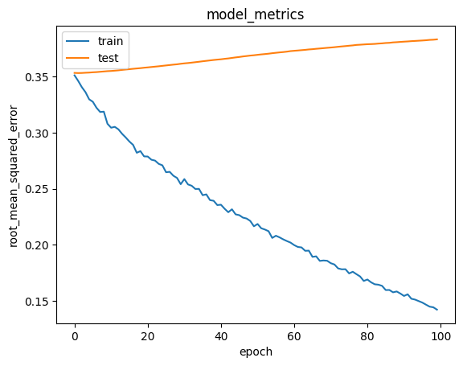
</div>

Data visual diatas berdasarkan model yang telah dibuat sebelumnya menunjukan `root mean squared error` memperoleh nilai sekitar 0.15 pada data latih dan 0.40 pada data uji. Ini berarti bahwa model yang telah dibuat menghasilkan rekomendasi yang cukup baik.

## Kesimpulan
Berdasarkan setiap proses yang telah dilakukan dalam proyek ini, dapat disimpulkan bahwa:

1. `Garena Free Fire - World Series` merupakan permainan yang saat ini sangat diminati oleh pengguna, karena permainan ini mendapatkan total penilaian paling tinggi dibanding permainan lain yaitu lebih dari 80.000.000 penilaian.
2. Proyek ini berhasil mengimplementasikan metode `Content-based filtering` dan `Collaborative filtering` ke dalam sistem rekomendasi. Hal ini dibuktikan dengan keberhasilan model merekomendasikan permainan berdasarkan kategori permainan dengan aktivitas pengguna.
3. Proyek ini berhasil membangun sistem rekomendasi yang baik. Hal ini dibuktikan melalui metrik yang dihasilkan melalui model yang telah dibuat, dimana metrik `precision` memperoleh nilai `1.0` yang berarti nilai sempurna, serta metrik `root mean squared error` yang memperoleh nilai `0.15` pada data latih dan `0.40` pada data uji yang artinya model ini cukup baik untuk digunakan.


## Referensi
1. Purnama, R. (2021). Perancangan Aplikasi Game Petualangan Si Unyil Berbasis Android Menggunakan Metode Finite State Mechine. Jurnal Dunia Ilmu, 1(1).
2. Wahyudi, B. (2022). Prediksi Peringkat Aplikasi di Google Play Menggunakan Metode Random Forest. Jurnal Nasional Teknologi Komputer, 2(1), 38-47
1. Sari, K. R., Suharso, W., & Azhar, Y. (2020). Pembuatan Sistem Rekomendasi Film dengan Menggunakan Metode Item Based Collaborative Filtering pada Apache Mahout. Jurnal Repositor, 2(6).
